<div align="center">
<picture>
  <source media="(prefers-color-scheme: dark)" srcset=".github/brand/banner-night.svg">
  
</picture>
<br><br>
<a href="#setup"><picture><source media="(prefers-color-scheme: dark)" srcset=".github/brand/tab-setup-night.svg"></picture></a>
<a href="#how-its-put-together"><picture><source media="(prefers-color-scheme: dark)" srcset=".github/brand/tab-how-its-put-together-night.svg"></picture></a>
<a href="#license"><picture><source media="(prefers-color-scheme: dark)" srcset=".github/brand/tab-license-night.svg"></picture></a>
</div>

<br>

<div align="center">

[noamfav.github.io/Resume](https://noamfav.github.io/Resume/)

</div>

A résumé you can drive like a terminal. Same design language as
[nf-software.com](https://nf-software.com), pushed further: a boot log, a working
shell, htop meters, git-log history, and live ASCII-rendered 3D objects.

<p>
<a name="setup"></a>
<picture><source media="(prefers-color-scheme: dark)" srcset=".github/brand/section-setup-night.svg"></picture>
</p>

```bash
pnpm install
pnpm run dev      # dev server
pnpm run build    # production build into dist/
pnpm run deploy   # build, then publish dist/ to gh-pages
```

<p>
<a name="how-its-put-together"></a>
<picture><source media="(prefers-color-scheme: dark)" srcset=".github/brand/section-how-its-put-together-night.svg"></picture>
</p>

| Where | What |
| --- | --- |
| `public/data/*.json` | All the content: experience, education, projects, skills, languages, frameworks, tools, contact |
| `public/data/profile.json` | What only the CV needs: summary, spoken languages, which projects make the one page |
| `cv/` | The PDF résumé: `nfcv.cls` (the terminal look as a LaTeX class), `build.mjs` (writes `resume.tex`, `resume-anon.tex` and `RESUME.md` from the JSON), bundled fonts |
| `public/resume.pdf` | The PDF behind `wget resume.pdf`, from `pnpm run build:cv` (needs XeLaTeX) |
| `src/shell/` | tmux window list, vim statusline, `:` command line, help, boot log, footer, colorschemes |
| `src/term/` | The shell on the home page and its commands |
| `src/ascii/` | The GPU ASCII renderer, shared with NF Software, plus two scenes of its own (`code`, `stack`) |
| `src/ui/` | Panes, meters, htop tables, figlet, neofetch, filters |

Keys: `1`–`6` pages · `:` or `⌘K` command line · `/` search · `d` download the PDF ·
`t` colorscheme · `?` everything else.

<p>
<a name="license"></a>
<picture><source media="(prefers-color-scheme: dark)" srcset=".github/brand/section-license-night.svg"></picture>
</p>

MIT — see [LICENSE](LICENSE).

<div align="center">
Made with ❤️ by <a href="https://github.com/NoamFav">NoamFav</a>
</div>

<br>

<a href="https://nf-software.com">
<picture>
  <source media="(prefers-color-scheme: dark)" srcset=".github/brand/footer-night.svg">
  
</picture>
</a>
